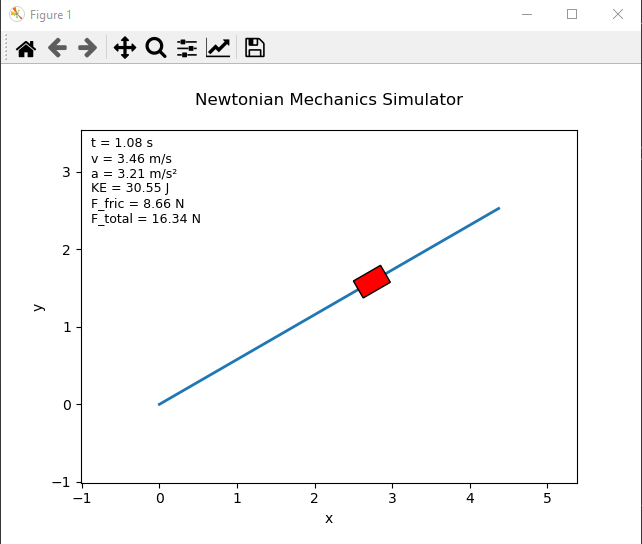

# Newtonian Mechanics Simulator (Java + Python)

A physics simulation engine written in Java that models motion of a block on an inclined plane with friction. Includes CSV data export and Python-based real-time animation

## Features

* Analytical physics modeling
* Friction and angle parameters
* Energy computation
* CSV output
* Python animation pipeline

## Requirements

- **JDK 21**
- **Maven 3.9+**
- **Python 3.10+** for visualization

```bash
pip install -r python/requirements.txt
```

## Project structure

```
src/main/java/            Java simulator source
python/                   Python visualizer (reads data.csv)
pom.xml                   Maven build config
```

## Build

From the project root:

```bash
mvn clean package
```

## Run the Java simulator

### Option A: Run with Maven (recommended during development)

```bash
mvn -q exec:java
```

The program will prompt for:

- weight (N)
- kinetic friction coefficient (μk)
- slope angle (degrees)
- slope length

It generates `data.csv` in the project root.

### Option B: Run the built JAR

```bash

java -jar target/simulator.jar
```

## Visualize (Python)

The visualizer reads the `data.csv` produced by the Java simulator.

From the project root:

```bash
python python/animation.py
```

## Full run (Java → Python)

```bash
mvn clean package
java -jar target/simulator.jar
python python/animation.py
```


